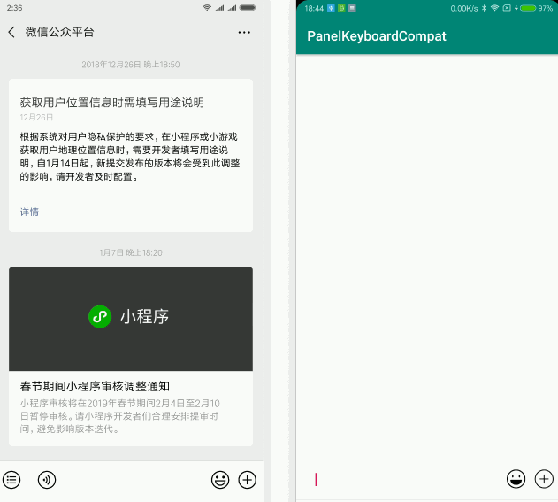

## 效果图


## 开始使用
#### Gradle
```
compile 'com.dyhdyh.widget:panelkeyboard:1.0.1'
```


#### 设置键盘模式
如果是Activity，在AndroidManifest.xml将你的Activity键盘模式设置成`adjustResize `

```
<activity
    android:name=".KeyboardActivity"
    android:windowSoftInputMode="adjustResize" />
```
如果是Dialog，需要给Window设置`WindowManager.LayoutParams.SOFT_INPUT_ADJUST_RESIZE `

```
getWindow().setSoftInputMode(WindowManager.LayoutParams.SOFT_INPUT_ADJUST_RESIZE);
```

#### 布局
无论Activity还是Dialog，最外层的View必须是`KeyboardRootLayout`
，`KeyboardPanelLayout`的面板子View必须设置id

```
<com.dyhdyh.widget.panelkeyboard.KeyboardRootLayout xmlns:android="http://schemas.android.com/apk/res/android"
    android:id="@+id/keyboard_layout"
    android:layout_width="match_parent"
    android:layout_height="match_parent">
    
    <!--KeyboardRootLayout只能包含一个子View-->

    <RelativeLayout
        android:layout_width="match_parent"
        android:layout_height="match_parent">
        
        ...

        <com.dyhdyh.widget.panelkeyboard.KeyboardPanelLayout
            android:id="@+id/panel_layout"
            android:layout_width="match_parent"
            android:layout_height="@dimen/def_keyboard_height"
            android:background="@android:color/white"
            android:visibility="gone">

            <!--面板View一定要用KeyboardPanelLayout包裹-->
            <RelativeLayout
                android:id="@+id/panel_emoji"
                android:layout_width="match_parent"
                android:layout_height="match_parent"
                android:visibility="gone">
    
                ...
                
            </RelativeLayout>

        </com.dyhdyh.widget.panelkeyboard.KeyboardPanelLayout>
    </RelativeLayout>
    
</com.dyhdyh.widget.panelkeyboard.KeyboardRootLayout>
```

#### 切换面板
```
final KeyboardRootLayout keyboardLayout = findViewById(R.id.keyboard_layout);
final KeyboardPanelLayout panelLayout = findViewById(R.id.panel_layout);
final EditText editText = findViewById(R.id.edit_text);

findViewById(R.id.btn_emoji).setOnClickListener(new View.OnClickListener() {
    @Override
    public void onClick(View v) {
        //panel_emoji就是表情面板的id
        panelLayout.togglePanelView(R.id.panel_emoji, keyboardLayout.isKeyboardShow(), editText);
        
        //如果是Dialog，第一个参数是Window
        //panelLayout.togglePanelView(getWindow(), R.id.panel_emoji, keyboardLayout.isKeyboardShow(), editText);
    }
});
```


#### 全屏主题兼容
如果Activity用了全屏主题，还需要调用`dispatchKeyEventInFullScreen`

```
@Override
public boolean dispatchKeyEvent(KeyEvent event) {
    if (keyboardLayout.dispatchKeyEventInFullScreen(event)) {
        return true;
    }
    return super.dispatchKeyEvent(event);
}
```